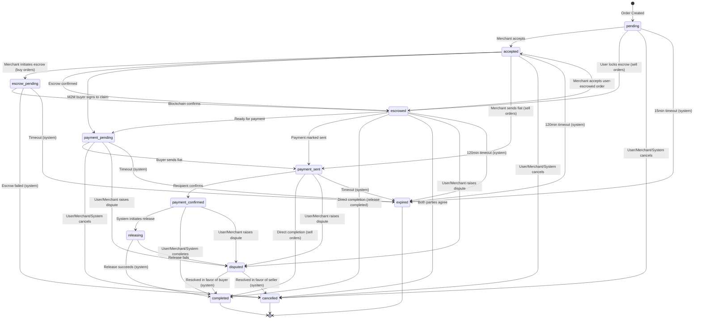
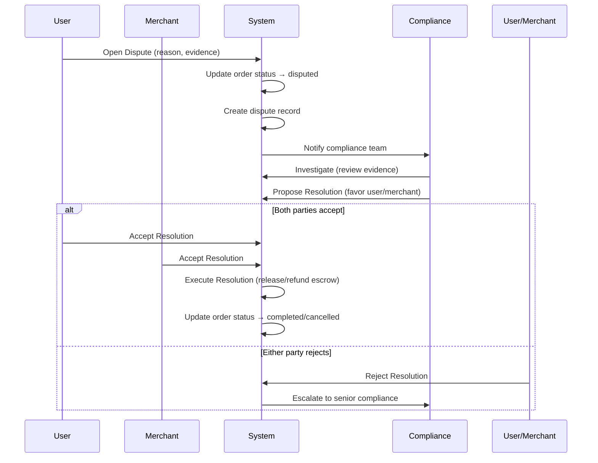

# Blip Money - Target Domain Contract Specification

**Version:** 1.0
**Status:** Target Contract (To Enforce)
**Last Updated:** 2026-02-12

---

## 1. Overview

This document defines the **canonical contract** for Blip Money's P2P order system. All components (API, UI, database, smart contracts) MUST conform to this specification.

**Key Principles:**
- **Single Source of Truth**: One authoritative status list, one state machine
- **Deterministic Transitions**: Predictable state changes with clear preconditions
- **Idempotency**: Duplicate requests produce same result without side effects
- **Auditability**: Every state change logged with actor, timestamp, metadata
- **Fail-Safe**: Timers enforce resolution; disputes protect locked funds

---

## 2. Core Entities

### 2.1 Order

The central entity representing a P2P trade between parties.

**Fields:**

| Field | Type | Required | Description |
|-------|------|----------|-------------|
| `id` | UUID | ✓ | Unique order identifier |
| `order_number` | VARCHAR(20) | ✓ | Human-readable order number (BM-YYMMDD-XXXX) |
| `order_version` | INT | ✓ | Monotonically increasing version number (increments on each update) |
| `type` | OfferType | ✓ | `buy` or `sell` (from merchant perspective) |
| `status` | OrderStatus | ✓ | Current order status (see §3) |
| `user_id` | UUID | ✓ | User party in the order |
| `merchant_id` | UUID | ✓ | Merchant party (seller in buy orders, buyer in sell orders) |
| `buyer_merchant_id` | UUID | - | For M2M: merchant acting as buyer |
| `offer_id` | UUID | ✓ | Offer that was matched |
| `payment_method` | PaymentMethod | ✓ | `bank` or `cash` |
| `crypto_amount` | DECIMAL(20,6) | ✓ | Amount of crypto (USDC) |
| `crypto_currency` | VARCHAR(10) | ✓ | Default: `USDC` |
| `fiat_amount` | DECIMAL(20,2) | ✓ | Amount of fiat (AED) |
| `fiat_currency` | VARCHAR(10) | ✓ | Default: `AED` |
| `rate` | DECIMAL(10,4) | ✓ | Exchange rate at order creation |
| `platform_fee` | DECIMAL(20,6) | ✓ | Platform fee amount |
| `network_fee` | DECIMAL(20,6) | ✓ | Blockchain network fee |
| `protocol_fee_percentage` | DECIMAL(5,2) | ✓ | Protocol fee tier (%) |
| `protocol_fee_amount` | DECIMAL(20,6) | - | Calculated protocol fee |
| `spread_preference` | ENUM | ✓ | `best`, `fastest`, `cheap` |
| `escrow_tx_hash` | VARCHAR(128) | - | Transaction hash when escrow locked |
| `escrow_trade_id` | BIGINT | - | On-chain trade ID for release |
| `escrow_trade_pda` | VARCHAR(64) | - | Trade PDA address |
| `escrow_pda` | VARCHAR(64) | - | Escrow vault PDA address |
| `escrow_creator_wallet` | VARCHAR(64) | - | Wallet that locked escrow |
| `release_tx_hash` | VARCHAR(128) | - | Transaction hash when escrow released |
| `refund_tx_hash` | VARCHAR(128) | - | Transaction hash when escrow refunded |
| `buyer_wallet_address` | VARCHAR(64) | - | Buyer's receiving wallet (buy orders) |
| `acceptor_wallet_address` | VARCHAR(64) | - | Merchant's wallet when accepting sell order |
| `payment_details` | JSONB | - | Payment info snapshot (bank details, etc.) |
| `created_at` | TIMESTAMP | ✓ | Order creation timestamp |
| `accepted_at` | TIMESTAMP | - | When merchant accepted order |
| `escrowed_at` | TIMESTAMP | - | When escrow locked on-chain |
| `payment_sent_at` | TIMESTAMP | - | When fiat payment marked sent |
| `payment_confirmed_at` | TIMESTAMP | - | When fiat payment confirmed |
| `completed_at` | TIMESTAMP | - | When order completed |
| `cancelled_at` | TIMESTAMP | - | When order cancelled |
| `expires_at` | TIMESTAMP | ✓ | Absolute expiry deadline |
| `cancelled_by` | ActorType | - | Who cancelled (`user`, `merchant`, `system`) |
| `cancellation_reason` | TEXT | - | Reason for cancellation |
| `extension_count` | INT | ✓ | Number of timer extensions granted (default: 0) |
| `max_extensions` | INT | ✓ | Maximum extensions allowed (default: 3) |
| `extension_requested_by` | ActorType | - | Who requested last extension |
| `extension_requested_at` | TIMESTAMP | - | When extension requested |
| `last_extended_at` | TIMESTAMP | - | When last extension granted |
| `has_manual_message` | BOOLEAN | ✓ | User sent manual message (chat categorization) |
| `assigned_compliance_id` | UUID | - | Compliance officer assigned to dispute |
| `is_custom` | BOOLEAN | ✓ | Is this a custom/big order (default: false) |
| `custom_notes` | TEXT | - | Notes for custom orders |
| `premium_percent` | DECIMAL(5,2) | ✓ | Premium percentage for big orders (default: 0) |

**Invariants:**
- `order_version` MUST be monotonically increasing (never decrements)
- `created_at` MUST be immutable after creation
- `expires_at` MUST be set at creation and MUST NOT be null
- If `escrow_tx_hash` is set, `release_tx_hash` XOR `refund_tx_hash` MUST be set before completing
- `extension_count` MUST be ≤ `max_extensions`
- M2M orders: `buyer_merchant_id` MUST be set and different from `merchant_id`
- Terminal statuses (`completed`, `cancelled`, `expired`) MUST have corresponding timestamp set

---

### 2.2 Offer

Merchant's advertisement to buy or sell crypto.

**Fields:**

| Field | Type | Required | Description |
|-------|------|----------|-------------|
| `id` | UUID | ✓ | Unique offer identifier |
| `merchant_id` | UUID | ✓ | Merchant who created offer |
| `type` | OfferType | ✓ | `buy` or `sell` |
| `payment_method` | PaymentMethod | ✓ | `bank` or `cash` |
| `rate` | DECIMAL(10,4) | ✓ | Exchange rate |
| `rate_type` | RateType | ✓ | `fixed` or `market_margin` |
| `margin_percent` | DECIMAL(5,2) | - | Margin % if market_margin |
| `min_amount` | DECIMAL(20,2) | ✓ | Minimum order size (fiat) |
| `max_amount` | DECIMAL(20,2) | ✓ | Maximum order size (fiat) |
| `available_amount` | DECIMAL(20,2) | ✓ | Current liquidity available |
| `bank_name` | VARCHAR(100) | - | Required if payment_method=bank |
| `bank_account_name` | VARCHAR(100) | - | Required if payment_method=bank |
| `bank_iban` | VARCHAR(34) | - | Required if payment_method=bank |
| `location_name` | VARCHAR(100) | - | Required if payment_method=cash |
| `location_address` | TEXT | - | Required if payment_method=cash |
| `location_lat` | DECIMAL(10,7) | - | GPS latitude |
| `location_lng` | DECIMAL(10,7) | - | GPS longitude |
| `meeting_instructions` | TEXT | - | Cash meeting instructions |
| `is_active` | BOOLEAN | ✓ | Offer is live (default: true) |
| `requires_kyc_level` | INT | ✓ | Minimum KYC level (default: 0) |
| `created_at` | TIMESTAMP | ✓ | Creation timestamp |
| `updated_at` | TIMESTAMP | ✓ | Last update timestamp |

**Invariants:**
- `max_amount` ≥ `min_amount`
- `available_amount` ≥ 0
- Bank offers MUST have bank details
- Cash offers MUST have location details
- When order created, `available_amount` decreases by `crypto_amount`
- When order cancelled/expired (before escrowed), `available_amount` increases by `crypto_amount`

---

### 2.3 User

Individual user account.

**Fields:**

| Field | Type | Required | Description |
|-------|------|----------|-------------|
| `id` | UUID | ✓ | Unique user ID |
| `username` | VARCHAR(50) | ✓ | Unique username |
| `wallet_address` | VARCHAR(64) | - | Solana wallet address |
| `phone` | VARCHAR(20) | - | Phone number |
| `avatar_url` | TEXT | - | Profile picture URL |
| `kyc_status` | KycStatus | ✓ | `none`, `pending`, `verified`, `rejected` |
| `kyc_level` | INT | ✓ | KYC verification level (default: 0) |
| `total_trades` | INT | ✓ | Count of completed trades (default: 0) |
| `total_volume` | DECIMAL(20,2) | ✓ | Total fiat volume traded (default: 0) |
| `rating` | DECIMAL(2,1) | ✓ | Average rating (default: 5.0) |
| `balance` | DECIMAL(20,6) | ✓ | Offchain USDC balance (default: 0) |
| `created_at` | TIMESTAMP | ✓ | Account creation timestamp |
| `updated_at` | TIMESTAMP | ✓ | Last update timestamp |

**Invariants:**
- `username` MUST be unique
- `wallet_address` MUST be unique if set
- `balance` MUST be ≥ 0
- `total_trades` increments on order completion
- `total_volume` increases on order completion

---

### 2.4 Merchant

Merchant/exchange account.

**Fields:**

| Field | Type | Required | Description |
|-------|------|----------|-------------|
| `id` | UUID | ✓ | Unique merchant ID |
| `wallet_address` | VARCHAR(64) | ✓ | Solana wallet address (unique) |
| `username` | VARCHAR(50) | ✓ | Unique username |
| `business_name` | VARCHAR(100) | ✓ | Legal business name |
| `display_name` | VARCHAR(50) | ✓ | Public display name |
| `email` | VARCHAR(255) | ✓ | Contact email (unique) |
| `phone` | VARCHAR(20) | - | Contact phone |
| `avatar_url` | TEXT | - | Profile picture URL |
| `balance` | DECIMAL(20,6) | ✓ | Offchain USDC balance (default: 0) |
| `status` | MerchantStatus | ✓ | `pending`, `active`, `suspended`, `banned` |
| `verification_level` | INT | ✓ | Merchant verification level (default: 1) |
| `total_trades` | INT | ✓ | Completed trades count (default: 0) |
| `total_volume` | DECIMAL(20,2) | ✓ | Total fiat volume (default: 0) |
| `rating` | DECIMAL(2,1) | ✓ | Average rating (default: 5.0) |
| `rating_count` | INT | ✓ | Number of ratings (default: 0) |
| `avg_response_time_mins` | INT | ✓ | Average response time (default: 5) |
| `is_online` | BOOLEAN | ✓ | Currently online (default: false) |
| `last_seen_at` | TIMESTAMP | - | Last activity timestamp |
| `auto_accept_enabled` | BOOLEAN | ✓ | Auto-accept orders (default: false) |
| `auto_accept_max_amount` | DECIMAL(20,2) | - | Max amount for auto-accept |
| `big_order_threshold` | DECIMAL(20,2) | ✓ | Threshold for big orders (default: 10000) |
| `created_at` | TIMESTAMP | ✓ | Account creation timestamp |
| `updated_at` | TIMESTAMP | ✓ | Last update timestamp |

**Invariants:**
- `wallet_address` MUST be unique
- `email` MUST be unique
- `username` MUST be unique
- `balance` MUST be ≥ 0
- Only `active` merchants can have `is_active=true` offers

---

### 2.5 ChatMessage

Order-scoped chat messages.

**Fields:**

| Field | Type | Required | Description |
|-------|------|----------|-------------|
| `id` | UUID | ✓ | Unique message ID |
| `order_id` | UUID | ✓ | Order this message belongs to |
| `sender_type` | ActorType | ✓ | `user`, `merchant`, `system`, `compliance` |
| `sender_id` | UUID | - | ID of sender (null for system) |
| `message_type` | MessageType | ✓ | `text`, `image`, `system` |
| `content` | TEXT | ✓ | Message content |
| `image_url` | TEXT | - | Image attachment URL |
| `is_read` | BOOLEAN | ✓ | Message read status (default: false) |
| `read_at` | TIMESTAMP | - | When message was read |
| `created_at` | TIMESTAMP | ✓ | Message creation timestamp |

**Invariants:**
- Each order has ONE chat thread
- System messages have `sender_type='system'` and `sender_id=order_id`
- Messages are immutable after creation
- `is_read` is scoped to recipient (merchant vs user)

---

### 2.6 OrderEvent

Audit log of all order state changes.

**Fields:**

| Field | Type | Required | Description |
|-------|------|----------|-------------|
| `id` | UUID | ✓ | Unique event ID |
| `order_id` | UUID | ✓ | Order this event belongs to |
| `event_type` | VARCHAR(50) | ✓ | Event type (e.g., `status_changed_to_accepted`) |
| `actor_type` | ActorType | ✓ | Who triggered event |
| `actor_id` | UUID | - | ID of actor |
| `old_status` | OrderStatus | - | Previous status |
| `new_status` | OrderStatus | - | New status |
| `metadata` | JSONB | - | Additional event data |
| `created_at` | TIMESTAMP | ✓ | Event timestamp |

**Invariants:**
- Events are append-only (NEVER updated or deleted)
- Every status change creates an event
- Events ordered by `created_at` ASC

---

### 2.7 Dispute

Dispute record for contested orders.

**Fields:**

| Field | Type | Required | Description |
|-------|------|----------|-------------|
| `id` | UUID | ✓ | Unique dispute ID |
| `order_id` | UUID | ✓ | Order under dispute (unique) |
| `raised_by` | ActorType | ✓ | Who opened dispute |
| `raiser_id` | UUID | ✓ | ID of dispute opener |
| `reason` | DisputeReason | ✓ | Reason code |
| `description` | TEXT | - | Detailed description |
| `evidence_urls` | TEXT[] | - | Evidence attachments |
| `status` | DisputeStatus | ✓ | `open`, `investigating`, `resolved`, `escalated` |
| `resolution` | TEXT | - | Resolution outcome description |
| `resolved_in_favor_of` | ActorType | - | Winner of dispute |
| `assigned_to` | UUID | - | Compliance officer assigned |
| `assigned_at` | TIMESTAMP | - | When assigned |
| `created_at` | TIMESTAMP | ✓ | Dispute creation timestamp |
| `resolved_at` | TIMESTAMP | - | When resolved |

**Invariants:**
- One dispute per order (unique `order_id`)
- Once `status='resolved'`, `resolved_at` MUST be set
- `resolved_in_favor_of` MUST be set when resolved
- Order status MUST be `disputed` while dispute is open

---

## 3. Canonical Order Statuses

**The authoritative list of all order statuses:**

| Status | Description | Terminal |
|--------|-------------|----------|
| `pending` | Order created, awaiting merchant acceptance | No |
| `accepted` | Merchant accepted order | No |
| `escrow_pending` | Escrow transaction submitted, awaiting confirmation | No |
| `escrowed` | Crypto locked in on-chain escrow | No |
| `payment_pending` | Awaiting fiat payment | No |
| `payment_sent` | Fiat payment marked as sent | No |
| `payment_confirmed` | Fiat payment confirmed by recipient | No |
| `releasing` | Escrow release transaction in progress | No |
| `completed` | Order successfully completed | **Yes** |
| `cancelled` | Order cancelled before completion | **Yes** |
| `disputed` | Order under dispute resolution | No |
| `expired` | Order timed out | **Yes** |

**Notes:**
- Terminal statuses (`completed`, `cancelled`, `expired`) allow NO further transitions
- This list is the ONLY valid set of statuses
- Any code referencing other statuses is invalid

---

## 4. Order Types & Role Mapping

### 4.1 Order Type Definitions

| Type | Description | Buyer Role | Seller Role | Escrow Locker |
|------|-------------|------------|-------------|---------------|
| **BUY** | User buys crypto from merchant | User | Merchant | Merchant |
| **SELL** | User sells crypto to merchant | Merchant | User | User |
| **U2M** | Generic user-to-merchant | Varies | Varies | Depends |
| **M2M** | Merchant-to-merchant | `buyer_merchant_id` | `merchant_id` | Seller merchant |

### 4.2 Field Population

**BUY Order:**
```
type: 'buy'
user_id: <user>
merchant_id: <merchant>
buyer_merchant_id: null
escrow_creator_wallet: <merchant wallet>
buyer_wallet_address: <user wallet>
```

**SELL Order:**
```
type: 'sell'
user_id: <user>
merchant_id: <merchant>
buyer_merchant_id: null
escrow_creator_wallet: <user wallet>
acceptor_wallet_address: <merchant wallet> (set when merchant accepts)
```

**M2M Order:**
```
type: 'buy' or 'sell'
user_id: <placeholder user for broadcast model>
merchant_id: <seller merchant>
buyer_merchant_id: <buyer merchant>
escrow_creator_wallet: <seller merchant wallet>
acceptor_wallet_address: <buyer merchant wallet> (set when accepted)
```

---

## 5. State Machine: Allowed Transitions

### 5.1 Transition Rules

Each transition specifies:
- **From Status** → **To Status**
- **Allowed Actors**: Who can perform this transition
- **Preconditions**: What must be true
- **Side Effects**: What happens (balance changes, liquidity, events)

### 5.2 Transition Diagram (Mermaid)



### 5.3 Detailed Transition Table

#### From `pending`

| To Status | Allowed Actors | Preconditions | Side Effects |
|-----------|----------------|---------------|--------------|
| `accepted` | `merchant` | Merchant has liquidity | Set `accepted_at`, extend timer to 120min, reassign `merchant_id` if different merchant claims |
| `escrowed` | `user`, `merchant`, `system` | Escrow tx confirmed | Set `escrowed_at`, extend timer to 120min |
| `cancelled` | `user`, `merchant`, `system` | - | Restore liquidity, set `cancelled_at` |
| `expired` | `system` | 15min elapsed | Restore liquidity, set `cancelled_at` |

#### From `accepted`

| To Status | Allowed Actors | Preconditions | Side Effects |
|-----------|----------------|---------------|--------------|
| `escrow_pending` | `merchant`, `system` | Merchant initiates escrow | - |
| `escrowed` | `user`, `merchant`, `system` | Escrow confirmed | Set `escrowed_at`, extend timer to 120min |
| `payment_pending` | `merchant` | M2M acceptance | Set buyer_merchant_id if needed |
| `payment_sent` | `merchant` | Sell order, escrow locked | Set `payment_sent_at` |
| `cancelled` | `user`, `merchant`, `system` | - | Restore liquidity, set `cancelled_at` |
| `expired` | `system` | 120min elapsed | Restore liquidity, set `cancelled_at` |

#### From `escrow_pending`

| To Status | Allowed Actors | Preconditions | Side Effects |
|-----------|----------------|---------------|--------------|
| `escrowed` | `system` | Blockchain confirms | Set `escrowed_at`, extend timer to 120min |
| `cancelled` | `system` | Escrow failed | Restore liquidity |
| `expired` | `system` | Timeout | Restore liquidity |

#### From `escrowed`

| To Status | Allowed Actors | Preconditions | Side Effects |
|-----------|----------------|---------------|--------------|
| `accepted` | `merchant` | Sell order acceptance | Set `accepted_at`, extend timer |
| `payment_pending` | `user`, `merchant`, `system` | - | - |
| `payment_sent` | `user`, `merchant` | - | Set `payment_sent_at` |
| `completed` | `user`, `merchant`, `system` | `release_tx_hash` set | Deduct seller balance, credit buyer balance, set `completed_at`, update stats |
| `cancelled` | `user`, `merchant`, `system` | Both agree OR no escrow locked | Refund escrow to creator |
| `disputed` | `user`, `merchant` | - | Create dispute record |
| `expired` | `system` | 120min elapsed | Move to `disputed` if escrow locked, else `cancelled` |

#### From `payment_pending`

| To Status | Allowed Actors | Preconditions | Side Effects |
|-----------|----------------|---------------|--------------|
| `payment_sent` | `user`, `merchant` | - | Set `payment_sent_at` |
| `cancelled` | `user`, `merchant`, `system` | - | Refund escrow |
| `disputed` | `user`, `merchant` | - | Create dispute |
| `expired` | `system` | Timeout | Move to `disputed` |

#### From `payment_sent`

| To Status | Allowed Actors | Preconditions | Side Effects |
|-----------|----------------|---------------|--------------|
| `payment_confirmed` | `user`, `merchant` | Recipient confirms | Set `payment_confirmed_at` |
| `completed` | `user`, `merchant`, `system` | `release_tx_hash` set (sell orders) | Complete order, update balances |
| `disputed` | `user`, `merchant` | - | Create dispute |
| `expired` | `system` | Timeout | Move to `disputed` |

#### From `payment_confirmed`

| To Status | Allowed Actors | Preconditions | Side Effects |
|-----------|----------------|---------------|--------------|
| `releasing` | `system` | System initiates release | - |
| `completed` | `user`, `merchant`, `system` | `release_tx_hash` set | Complete order, update balances |
| `disputed` | `user`, `merchant` | - | Create dispute |

#### From `releasing`

| To Status | Allowed Actors | Preconditions | Side Effects |
|-----------|----------------|---------------|--------------|
| `completed` | `system` | Release tx confirmed | Complete order, update balances |
| `disputed` | `user`, `merchant` | Release failed | Create dispute |

#### From `disputed`

| To Status | Allowed Actors | Preconditions | Side Effects |
|-----------|----------------|---------------|--------------|
| `completed` | `system` | Resolved in favor of buyer | Release escrow to buyer, update balances |
| `cancelled` | `system` | Resolved in favor of seller | Refund escrow to seller, restore liquidity |

#### From `completed`, `cancelled`, `expired`

**No transitions allowed (terminal states).**

---

## 6. Roles & Permissions

### 6.1 Actor Types

| Actor | Description |
|-------|-------------|
| `user` | Regular user account |
| `merchant` | Merchant/exchange account |
| `system` | Automated system actions (timers, blockchain events) |
| `compliance` | Compliance officer (dispute resolution) |

### 6.2 Permission Matrix

| Action | User | Merchant | System | Compliance |
|--------|------|----------|--------|------------|
| **Create Order** | ✓ | ✓ (M2M) | - | - |
| **Accept Order** | - | ✓ | - | - |
| **Lock Escrow** | ✓ (sell) | ✓ (buy) | - | - |
| **Mark Payment Sent** | ✓ (sell) | ✓ (buy) | - | - |
| **Confirm Payment** | ✓ (buy) | ✓ (sell) | - | - |
| **Release Escrow** | ✓ | ✓ | ✓ | - |
| **Cancel (pending)** | ✓ | ✓ | ✓ | - |
| **Cancel (accepted+)** | - | - | ✓ (timeout) | - |
| **Open Dispute** | ✓ | ✓ | - | - |
| **Resolve Dispute** | - | - | ✓ | ✓ |
| **Expire Orders** | - | - | ✓ | - |
| **Send Chat Message** | ✓ | ✓ | ✓ (system msgs) | ✓ (in disputes) |
| **Mark Messages Read** | ✓ | ✓ | - | ✓ |

### 6.3 Detailed Permission Rules

**Who can accept orders?**
- ONLY merchants can accept
- Any merchant can accept broadcast pending/escrowed orders (Uber model)
- Accepting reassigns `merchant_id` to acceptor (unless M2M, then sets `buyer_merchant_id`)

**Who can cancel orders?**
- **From `pending` or `accepted`**: User, Merchant, System
- **From `escrowed` onward**: ONLY System (via timeout) OR both parties agree
- **After escrow locked**: Cannot cancel unilaterally (must dispute or complete)

**Who can mark payment_sent?**
- **BUY orders**: Merchant sends fiat (merchant can mark)
- **SELL orders**: User sends fiat (user can mark)
- **M2M orders**: Buyer merchant sends fiat

**Who can complete orders?**
- **User**: Can complete sell orders after releasing escrow
- **Merchant**: Can complete after confirming payment received
- **System**: Auto-completes after release tx confirmed

**Who can dispute?**
- User or Merchant can open dispute from `escrowed`, `payment_pending`, `payment_sent`, `payment_confirmed`

**Who can resolve disputes?**
- ONLY System or Compliance officers
- Resolution outcomes: `completed` (favor buyer) or `cancelled` (favor seller/refund)

---

## 7. Timers & Expiration

### 7.1 Global Timer

**All orders have a 15-minute timer from creation.**

- Set at order creation: `expires_at = created_at + 15 minutes`
- Timer is GLOBAL (applies to all statuses)
- Orders MUST complete or be explicitly extended within 15 minutes

### 7.2 Status-Specific Timeouts (Reference)

Legacy per-status timeouts (for context):

| Status | Timeout | Outcome |
|--------|---------|---------|
| `pending` | 15 min | `cancelled` (no one accepted) |
| `accepted` | 120 min | `cancelled` or `disputed` (if escrow locked) |
| `escrowed` | 120 min | `disputed` (money locked) |
| `payment_sent` | 120 min | `disputed` (awaiting confirmation) |
| `disputed` | 72 hours | Escalated to senior compliance |

**NOTE:** The 15-minute global timer takes precedence. Status-specific timeouts apply for extended orders.

### 7.3 Extension System

**Max Extensions:** 3 per order (configurable via `max_extensions`)

**Extension Duration:**
- `pending`: +15 minutes
- `accepted`: +30 minutes
- `escrowed`: +60 minutes
- `payment_sent`: +120 minutes

**Extension Flow:**
1. Party requests extension (`extension_requested_by`, `extension_requested_at`)
2. Counterparty approves OR auto-approved if conditions met
3. `expires_at` += extension duration
4. `extension_count` increments
5. `last_extended_at` = NOW()

**Extension Limits:**
- Cannot extend if `extension_count >= max_extensions`
- Cannot extend from terminal statuses
- Extensions only allowed from: `pending`, `accepted`, `escrowed`, `payment_sent`

### 7.4 Expiration Outcomes

**When timer expires:**

| Current Status | Escrow Locked? | Max Extensions Reached? | Outcome |
|----------------|----------------|-------------------------|---------|
| `pending` | No | - | `cancelled` |
| `accepted` | No | - | `cancelled` |
| `accepted` | Yes | - | `disputed` |
| `escrowed` | Yes | Any | `disputed` |
| `payment_pending` | Yes | Any | `disputed` |
| `payment_sent` | Yes | Any | `disputed` |
| `payment_confirmed` | Yes | Any | `disputed` |

**Rationale:**
- Before escrow: safe to cancel (no funds at risk)
- After escrow: funds locked → must dispute to protect both parties

---

## 8. Offchain Escrow Definition

### 8.1 What is "Escrowed"?

An order is considered **escrowed** when:
- `escrow_tx_hash` is NOT NULL (blockchain transaction confirmed)
- `escrow_pda` or `escrow_trade_pda` is set
- `status` is `escrowed` or later (excluding terminal states)

### 8.2 Escrow Fields

| Field | Purpose |
|-------|---------|
| `escrow_tx_hash` | Transaction hash when crypto locked |
| `escrow_trade_id` | On-chain trade ID (for release/refund) |
| `escrow_trade_pda` | Trade PDA address |
| `escrow_pda` | Escrow vault PDA address |
| `escrow_creator_wallet` | Wallet that locked funds (seller) |
| `release_tx_hash` | Transaction hash when released to buyer |
| `refund_tx_hash` | Transaction hash when refunded to seller |

### 8.3 Escrow Balance Tracking

**Offchain balances** (`users.balance`, `merchants.balance`) track non-escrowed funds.

**Balance Mutations:**

1. **Escrow Lock** (seller):
   ```sql
   UPDATE {users|merchants}
   SET balance = balance - crypto_amount
   WHERE id = seller_id
   ```

2. **Escrow Release** (buyer):
   ```sql
   UPDATE {users|merchants}
   SET balance = balance + crypto_amount
   WHERE id = buyer_id
   ```

3. **Escrow Refund** (seller):
   ```sql
   UPDATE {users|merchants}
   SET balance = balance + crypto_amount
   WHERE id = seller_id
   ```

**Critical Invariant:**
- Balance updates happen EXACTLY ONCE per escrow lifecycle
- Lock on `escrowed_at` timestamp
- Release on `completed_at` OR Refund on dispute resolution
- NEVER update balance on status change to `completed` without `release_tx_hash`

### 8.4 Escrow Proofs

**Audit Trail:**
- Every escrow lock logged in `order_events` (event_type: `escrow_locked`)
- Every escrow release logged in `order_events` (event_type: `escrow_released`)
- Every escrow refund logged in `order_events` (event_type: `escrow_refunded`)
- Blockchain transaction hashes provide on-chain proof

**Verification:**
```sql
-- Check escrow is locked
SELECT * FROM orders
WHERE id = ? AND escrow_tx_hash IS NOT NULL

-- Verify release/refund
SELECT * FROM orders
WHERE id = ? AND (release_tx_hash IS NOT NULL OR refund_tx_hash IS NOT NULL)
```

---

## 9. Dispute Model

### 9.1 When Disputes Can Be Opened

**Allowed Statuses:**
- `escrowed`
- `payment_pending`
- `payment_sent`
- `payment_confirmed`
- `releasing`

**Preconditions:**
- Order has escrow locked (`escrow_tx_hash IS NOT NULL`)
- No existing dispute (`one dispute per order_id`)

**Prohibited:**
- Cannot dispute `pending` or `accepted` (just cancel)
- Cannot dispute terminal statuses (`completed`, `cancelled`, `expired`)

### 9.2 Dispute Reasons

| Reason | Code | Description |
|--------|------|-------------|
| Payment Not Received | `payment_not_received` | Buyer claims payment sent but seller denies |
| Crypto Not Received | `crypto_not_received` | Seller claims crypto not released |
| Wrong Amount | `wrong_amount` | Amount mismatch (fiat or crypto) |
| Fraud | `fraud` | Suspected fraudulent activity |
| Other | `other` | Other issues (requires description) |

### 9.3 Who Can Resolve

**Resolvers:**
- `system` (automated rules)
- `compliance` (compliance officers)

**Users and Merchants CANNOT resolve disputes themselves.**

### 9.4 Dispute Resolution Outcomes

| Outcome | Result | Action |
|---------|--------|--------|
| **Favor Buyer** | Buyer wins | Order → `completed`, escrow released to buyer |
| **Favor Seller** | Seller wins | Order → `cancelled`, escrow refunded to seller |
| **Split** | Partial refund | Escrow split based on percentage (future feature) |

### 9.5 Dispute Flow



### 9.6 Dispute Invariants

- One dispute per order (unique `order_id`)
- Dispute `status` must progress: `open` → `investigating` → `resolved`
- Once `resolved`, dispute cannot be reopened
- Order status MUST be `disputed` while dispute is `open` or `investigating`
- Resolution MUST specify `resolved_in_favor_of` (user, merchant, or system for splits)

---

## 10. Invariants (Global Constraints)

### 10.1 Order Invariants

1. **Version Monotonicity**: `order_version` MUST increment on every update, never decrement
2. **Single Chat Thread**: One chat thread per order (all messages have same `order_id`)
3. **Idempotent Actions**: Duplicate status change requests return success if already at target status (no-op)
4. **No Stale Updates**: WebSocket updates include `order_version` to detect stale data
5. **Escrow Consistency**: If `escrow_tx_hash` set, MUST have `release_tx_hash` XOR `refund_tx_hash` before completing
6. **Terminal Immutability**: Orders in terminal statuses (`completed`, `cancelled`, `expired`) CANNOT transition
7. **Timestamp Consistency**: Status-specific timestamps (`accepted_at`, `escrowed_at`, etc.) MUST align with status
8. **Balance Non-Negative**: User and merchant balances MUST always be ≥ 0
9. **Liquidity Conservation**: Offer `available_amount` decreases on order creation, increases on cancellation (before escrow)
10. **One Dispute Per Order**: `disputes.order_id` is unique

### 10.2 Transition Invariants

1. **Actor Authorization**: Only allowed actors can perform transitions (checked by state machine)
2. **Precondition Validation**: All preconditions validated before transition
3. **Side Effect Atomicity**: All side effects (balance updates, liquidity, events) execute in single transaction
4. **Event Logging**: Every transition creates an `order_events` entry
5. **No Time Travel**: `created_at` ≤ `accepted_at` ≤ `escrowed_at` ≤ ... ≤ `completed_at`

### 10.3 Data Integrity Invariants

1. **Foreign Key Integrity**: All `user_id`, `merchant_id`, `offer_id` references are valid
2. **Unique Order Numbers**: `order_number` is unique and generated deterministically
3. **Consistent Currency**: `crypto_currency` and `fiat_currency` are immutable after creation
4. **Rate Snapshot**: `rate` is captured at order creation and immutable
5. **M2M Validity**: If `buyer_merchant_id` set, it MUST differ from `merchant_id`

### 10.4 Concurrency Invariants

1. **Row-Level Locking**: Use `SELECT ... FOR UPDATE` when reading order before status change
2. **Optimistic Locking**: Use `order_version` to detect concurrent updates
3. **Transaction Isolation**: All multi-step operations wrapped in database transactions
4. **Idempotency Keys**: API endpoints accept idempotency keys to prevent duplicate processing

---

## 11. Flows by Order Type

### 11.1 BUY Flow (User buys crypto from merchant)

**Roles:**
- **Buyer**: User
- **Seller**: Merchant
- **Escrow Locker**: Merchant

**Happy Path:**
```
1. User creates order (type='buy', crypto_amount, offer_id)
   → status: pending

2. Merchant accepts order
   → status: accepted
   → Set accepted_at, extend timer to 120min

3. Merchant locks escrow on-chain
   → status: escrowed
   → Set escrow_tx_hash, escrow_pda, escrow_creator_wallet

4. User sends fiat payment (bank transfer or cash)
   → status: payment_sent
   → Set payment_sent_at

5. Merchant confirms fiat received
   → status: payment_confirmed
   → Set payment_confirmed_at

6. Merchant (or user) releases escrow to user's wallet
   → status: completed
   → Set release_tx_hash, completed_at
   → Credit user balance, update stats
```

**Cancellation Branches:**
- From `pending`: User or Merchant cancels → `cancelled`
- From `accepted`: User or Merchant cancels → `cancelled`
- Timeout from `pending` (15min) → `expired`
- Timeout from `accepted+` (120min) → `disputed` (if escrowed) or `cancelled`

**Dispute Branch:**
- From `escrowed`, `payment_sent`, `payment_confirmed`: User or Merchant raises dispute → `disputed`
- Compliance resolves → `completed` (favor user) or `cancelled` (favor merchant)

---

### 11.2 SELL Flow (User sells crypto to merchant)

**Roles:**
- **Buyer**: Merchant
- **Seller**: User
- **Escrow Locker**: User

**Happy Path:**
```
1. User creates order (type='sell', crypto_amount, offer_id)
   → status: pending

2. User locks escrow on-chain (escrow-first model)
   → status: escrowed
   → Set escrow_tx_hash, escrow_pda, escrow_creator_wallet
   → Extend timer to 120min

3. Merchant accepts escrowed order
   → status: accepted (OR stays escrowed)
   → Set accepted_at, acceptor_wallet_address

4. Merchant sends fiat payment to user
   → status: payment_sent
   → Set payment_sent_at

5. User confirms fiat received
   → status: payment_confirmed
   → Set payment_confirmed_at

6. User releases escrow to merchant's wallet
   → status: completed
   → Set release_tx_hash, completed_at
   → Credit merchant balance, update stats
```

**Alternative Flow (Accept First):**
```
1. User creates order (type='sell')
   → status: pending

2. Merchant accepts order
   → status: accepted

3. User locks escrow
   → status: escrowed

4-6. (Same as above)
```

**Cancellation/Dispute:** Same rules as BUY flow

---

### 11.3 M2M Flow (Merchant-to-merchant)

**Roles:**
- **Buyer Merchant**: `buyer_merchant_id`
- **Seller Merchant**: `merchant_id`
- **Escrow Locker**: Seller Merchant

**Happy Path (Seller initiates):**
```
1. Seller Merchant creates order (type='sell', target_merchant_id OR broadcast)
   → user_id: placeholder user for broadcast model
   → merchant_id: seller merchant
   → buyer_merchant_id: null (to be set on acceptance)
   → status: pending OR escrowed (if escrow-first)

2. Buyer Merchant accepts order
   → status: accepted (OR escrowed if already locked)
   → Set buyer_merchant_id, acceptor_wallet_address

3. Seller Merchant locks escrow (if not already locked)
   → status: escrowed

4. Buyer Merchant sends fiat payment
   → status: payment_sent

5. Seller Merchant confirms payment
   → status: payment_confirmed

6. Seller releases escrow to Buyer Merchant wallet
   → status: completed
   → Credit buyer merchant balance, update stats
```

**Happy Path (Buyer initiates):**
```
1. Buyer Merchant creates order (type='buy', target_merchant_id OR matched_offer_id)
   → merchant_id: seller merchant (from matched offer)
   → buyer_merchant_id: buyer merchant
   → status: pending

2. Seller Merchant accepts order
   → status: accepted

3. Seller Merchant locks escrow
   → status: escrowed

4-6. (Same as above)
```

---

## 12. API Contract

### 12.1 Create Order

**Endpoint:** `POST /api/orders`

**Request:**
```json
{
  "user_id": "uuid",
  "offer_id": "uuid",
  "type": "buy" | "sell",
  "crypto_amount": 100.50,
  "payment_method": "bank" | "cash",
  "buyer_wallet_address": "SolanaAddress...", // Required for buy orders
  "buyer_merchant_id": "uuid", // Optional, for M2M
  "escrow_tx_hash": "0x...", // Optional, for escrow-first sell orders
  "escrow_trade_id": 123456,
  "escrow_pda": "SolanaAddress...",
  "escrow_creator_wallet": "SolanaAddress..."
}
```

**Response:**
```json
{
  "success": true,
  "data": {
    "id": "uuid",
    "order_number": "BM-260212-A1B2",
    "status": "pending" | "escrowed",
    "expires_at": "2026-02-12T15:30:00Z",
    ...
  }
}
```

**Invariants:**
- MUST create order_events entry (event_type: `order_created`)
- MUST reserve liquidity (decrease offer `available_amount`)
- MUST set `expires_at = created_at + 15 minutes` (or 120min if escrowed)

---

### 12.2 Update Order Status

**Endpoint:** `PATCH /api/orders/:id/status`

**Request:**
```json
{
  "status": "accepted",
  "actor_type": "merchant",
  "actor_id": "uuid",
  "reason": "Optional cancellation reason",
  "acceptor_wallet_address": "SolanaAddress..." // For sell order acceptance
}
```

**Response:**
```json
{
  "success": true,
  "order": { ... }
}
```

**Validation:**
1. Validate transition is allowed (state machine)
2. Check actor has permission
3. Verify preconditions (e.g., escrow locked before completing)
4. Execute side effects atomically
5. Create order_events entry
6. Send websocket notification

**Idempotency:**
- If `current_status == new_status`, return `{ success: true, order: ... }` (no-op)

---

### 12.3 Lock Escrow

**Endpoint:** `POST /api/orders/:id/escrow`

**Request:**
```json
{
  "escrow_tx_hash": "0x...",
  "escrow_trade_id": 123456,
  "escrow_pda": "SolanaAddress...",
  "escrow_creator_wallet": "SolanaAddress..."
}
```

**Response:**
```json
{
  "success": true,
  "order": { ... }
}
```

**Side Effects:**
- Update order: `escrow_tx_hash`, `escrow_pda`, `escrowed_at`
- Transition status: `pending` | `accepted` → `escrowed`
- Deduct seller balance: `balance -= crypto_amount`
- Extend timer: `expires_at = NOW() + 120 minutes`

---

### 12.4 Release Escrow

**Endpoint:** `PATCH /api/orders/:id/escrow`

**Request:**
```json
{
  "release_tx_hash": "0x...",
  "actor_type": "user" | "merchant",
  "actor_id": "uuid"
}
```

**Response:**
```json
{
  "success": true,
  "order": { ... }
}
```

**Side Effects:**
- Update order: `release_tx_hash`, `completed_at`
- Transition status → `completed`
- Credit buyer balance: `balance += crypto_amount`
- Update stats: `total_trades++`, `total_volume += fiat_amount`

---

### 12.5 Open Dispute

**Endpoint:** `POST /api/orders/:id/dispute`

**Request:**
```json
{
  "raised_by": "user" | "merchant",
  "raiser_id": "uuid",
  "reason": "payment_not_received",
  "description": "Detailed explanation...",
  "evidence_urls": ["https://..."]
}
```

**Response:**
```json
{
  "success": true,
  "dispute": { ... }
}
```

**Side Effects:**
- Create dispute record
- Transition order status → `disputed`
- Notify compliance team
- Send system message to chat

---

## 13. WebSocket Updates

### 13.1 Order Status Changed

**Event:** `order-status-updated`

**Payload:**
```json
{
  "orderId": "uuid",
  "status": "accepted",
  "previousStatus": "pending",
  "order_version": 5,
  "updatedAt": "2026-02-12T15:30:00Z"
}
```

**Channels:**
- `user-{userId}`: User's personal channel
- `merchant-{merchantId}`: Merchant's personal channel
- `order-{orderId}`: Order-specific channel (all parties)

---

### 13.2 New Chat Message

**Event:** `new-message`

**Payload:**
```json
{
  "orderId": "uuid",
  "messageId": "uuid",
  "senderType": "user",
  "senderId": "uuid",
  "content": "Message text",
  "messageType": "text",
  "createdAt": "2026-02-12T15:30:00Z"
}
```

**Channels:**
- `order-{orderId}`: All parties see the message

---

## 14. Testing & Verification

### 14.1 Critical Test Scenarios

1. **Idempotency**: Duplicate status update requests return success without side effects
2. **Concurrency**: Two merchants accepting same order → one succeeds, other gets error
3. **Timer Expiry**: Order expires exactly at `expires_at` → status updated to `expired` or `disputed`
4. **Balance Consistency**: Escrow lock/release updates balances exactly once
5. **Dispute Protection**: Cannot complete order with escrow locked without `release_tx_hash`
6. **M2M Role Assignment**: `buyer_merchant_id` correctly set on acceptance
7. **Liquidity Restoration**: Cancelled/expired orders restore offer `available_amount`

### 14.2 Invariant Checks (SQL)

```sql
-- Check no orders have escrow locked but no release/refund
SELECT * FROM orders
WHERE escrow_tx_hash IS NOT NULL
  AND status = 'completed'
  AND release_tx_hash IS NULL
  AND refund_tx_hash IS NULL;
-- Expected: 0 rows

-- Check all completed orders have completed_at
SELECT * FROM orders
WHERE status = 'completed'
  AND completed_at IS NULL;
-- Expected: 0 rows

-- Check no negative balances
SELECT * FROM users WHERE balance < 0
UNION ALL
SELECT * FROM merchants WHERE balance < 0;
-- Expected: 0 rows

-- Check order_version increments
SELECT o1.id, o1.order_version, o2.order_version
FROM order_events oe1
JOIN order_events oe2 ON oe1.order_id = oe2.order_id AND oe1.created_at < oe2.created_at
JOIN orders o1 ON oe1.order_id = o1.id
JOIN orders o2 ON oe2.order_id = o2.id
WHERE o1.order_version >= o2.order_version;
-- Expected: 0 rows (version always increases)

-- Check one dispute per order
SELECT order_id, COUNT(*)
FROM disputes
GROUP BY order_id
HAVING COUNT(*) > 1;
-- Expected: 0 rows
```

---

## 15. Migration Path

### 15.1 From Current Implementation to Target Contract

**Phase 1: Add Missing Fields**
- Add `order_version` column (default: 1)
- Add database trigger to increment `order_version` on UPDATE
- Backfill `order_version` based on `order_events` count

**Phase 2: Enforce State Machine**
- Update `updateOrderStatus` to always validate transitions
- Remove direct SQL status updates bypassing validation
- Add `validateTransition` middleware to all status change endpoints

**Phase 3: Fix Balance Mutations**
- Audit all balance update locations
- Ensure balance updates only happen on:
  - Escrow lock (deduct seller)
  - Escrow release (credit buyer)
  - Escrow refund (credit seller)
- Remove any balance updates on status change to `completed` without tx hash check

**Phase 4: Idempotency & Versioning**
- Add `order_version` to WebSocket payloads
- Frontend checks version before applying updates
- API returns current order if status already matches (no-op)

**Phase 5: Dispute 2-Confirmation**
- Already implemented (no changes needed)

---

## 16. Open Questions & Future Enhancements

### 16.1 Open Questions

1. **Extension Auto-Approval**: Should extensions be auto-approved or require counterparty consent?
2. **Partial Refunds**: Should disputes support percentage splits (e.g., 70/30)?
3. **Reputation Impact**: How should disputes affect user/merchant ratings?
4. **Recurring Orders**: Should users be able to create recurring orders (e.g., weekly)?

### 16.2 Future Enhancements

1. **Multi-Currency Support**: Extend beyond USDC/AED
2. **Automated Market Making**: Dynamic rate adjustments based on demand
3. **Batch Escrow Operations**: Lock multiple orders in single transaction
4. **Cross-Chain Escrow**: Support Ethereum, Bitcoin, etc.
5. **Escrow Insurance**: Optional insurance for high-value orders
6. **Tiered Protocol Fees**: Different fees based on volume/membership tier
7. **Order Templates**: Merchants can create reusable order templates

---

## 17. Glossary

| Term | Definition |
|------|------------|
| **Actor** | Entity performing an action (user, merchant, system, compliance) |
| **Escrow** | Crypto funds locked in smart contract until trade completes |
| **Escrow-First** | Locking escrow before merchant accepts (sell orders) |
| **M2M** | Merchant-to-merchant trading |
| **Offchain Balance** | USDC balance tracked in database (not on blockchain) |
| **Order Version** | Monotonically increasing counter for optimistic locking |
| **PDA** | Program Derived Address (Solana escrow account) |
| **Terminal Status** | Status with no further transitions (completed, cancelled, expired) |
| **Trade ID** | On-chain identifier for escrow release/refund |
| **Transition** | Change from one status to another |

---

## 18. Revision History

| Version | Date | Author | Changes |
|---------|------|--------|---------|
| 1.0 | 2026-02-12 | Agent B | Initial contract specification |

---

**END OF SPECIFICATION**

---

## Appendix A: State Machine Implementation Reference

```typescript
// Example state machine validator
export function validateTransition(
  currentStatus: OrderStatus,
  newStatus: OrderStatus,
  actorType: ActorType
): { valid: boolean; error?: string } {

  // Idempotency: no-op if already at target
  if (currentStatus === newStatus) {
    return { valid: false, error: `Already at status: ${currentStatus}` };
  }

  // No transitions from terminal statuses
  if (['completed', 'cancelled', 'expired'].includes(currentStatus)) {
    return { valid: false, error: `Cannot transition from terminal status: ${currentStatus}` };
  }

  // Lookup allowed transitions
  const allowedTransitions = TRANSITION_RULES[currentStatus];
  if (!allowedTransitions) {
    return { valid: false, error: `No transitions defined from: ${currentStatus}` };
  }

  const rule = allowedTransitions.find(t => t.to === newStatus);
  if (!rule) {
    return { valid: false, error: `Transition ${currentStatus} → ${newStatus} not allowed` };
  }

  // Check actor permission
  if (!rule.allowedActors.includes(actorType)) {
    return { valid: false, error: `Actor ${actorType} cannot perform this transition` };
  }

  return { valid: true };
}
```

---

## Appendix B: Database Constraints (Recommended)

```sql
-- Ensure order_version increments
CREATE OR REPLACE FUNCTION check_order_version_increment()
RETURNS TRIGGER AS $$
BEGIN
  IF NEW.order_version <= OLD.order_version THEN
    RAISE EXCEPTION 'order_version must increment (old: %, new: %)', OLD.order_version, NEW.order_version;
  END IF;
  RETURN NEW;
END;
$$ LANGUAGE plpgsql;

CREATE TRIGGER enforce_order_version_increment
  BEFORE UPDATE ON orders
  FOR EACH ROW
  EXECUTE FUNCTION check_order_version_increment();

-- Ensure terminal statuses have timestamps
ALTER TABLE orders
  ADD CONSTRAINT completed_must_have_timestamp
  CHECK (status != 'completed' OR completed_at IS NOT NULL);

ALTER TABLE orders
  ADD CONSTRAINT cancelled_must_have_timestamp
  CHECK (status != 'cancelled' OR cancelled_at IS NOT NULL);

-- Ensure escrow completion has tx hash
ALTER TABLE orders
  ADD CONSTRAINT escrow_completion_requires_release
  CHECK (
    status != 'completed' OR
    escrow_tx_hash IS NULL OR
    release_tx_hash IS NOT NULL OR
    refund_tx_hash IS NOT NULL
  );
```

---

**This specification is the canonical contract for Blip Money's order system. All implementations MUST conform to these rules.**
