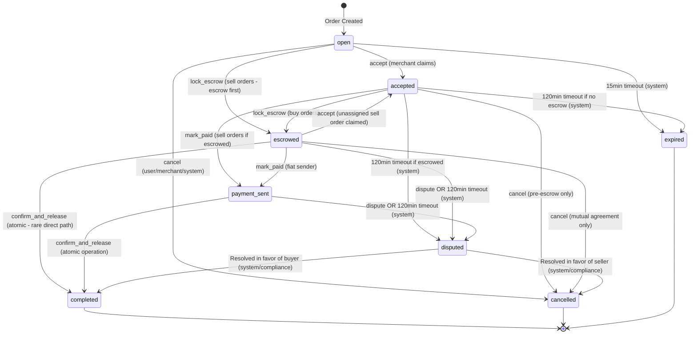

# Blip Money - Minimal Domain Specification (8-State Settlement Layer)

**Version:** 2.0
**Status:** Simplified Contract (8-State Minimal)
**Last Updated:** 2026-02-12

---

## 1. Overview

This document defines the **simplified canonical contract** for Blip Money's P2P order system. This is a reduction from the original 12-status system to a minimal 8-status design that eliminates micro-statuses while maintaining all critical safety guarantees.

**Key Simplifications:**
- **8 Statuses** (down from 12): Eliminated `escrow_pending`, `payment_pending`, `payment_confirmed`, `releasing`
- **6 Public Actions** (down from ~10): Cleaner API surface with atomic operations
- **~24 Transitions** (down from 44): Simpler state machine with clearer flows
- **Events > Statuses**: Payment confirmation becomes an event, not a status
- **Atomic Operations**: `confirm_and_release` combines payment confirmation + escrow release

**Core Principles (Unchanged):**
- **Single Source of Truth**: One authoritative status list, one state machine
- **Deterministic Transitions**: Predictable state changes with clear preconditions
- **Idempotency**: Duplicate requests produce same result without side effects
- **Auditability**: Every state change logged with actor, timestamp, metadata
- **Fail-Safe**: Timers enforce resolution; disputes protect locked funds

---

## 2. Core Entities

### 2.1 Order (Simplified)

The central entity representing a P2P trade between parties.

**Key Fields (Minimal Set):**

| Field | Type | Required | Description |
|-------|------|----------|-------------|
| `id` | UUID | ✓ | Unique order identifier |
| `order_number` | VARCHAR(20) | ✓ | Human-readable order number (BM-YYMMDD-XXXX) |
| `order_version` | INT | ✓ | Monotonically increasing version number |
| `type` | OfferType | ✓ | `buy` or `sell` (from merchant perspective) |
| `status` | OrderStatus | ✓ | Current order status (see §3 - 8 statuses only) |
| `user_id` | UUID | ✓ | User party in the order |
| `merchant_id` | UUID | ✓ | Merchant party (seller in buy orders, buyer in sell orders) |
| `buyer_merchant_id` | UUID | - | For M2M: merchant acting as buyer |
| `offer_id` | UUID | ✓ | Offer that was matched |
| `payment_method` | PaymentMethod | ✓ | `bank` or `cash` |
| `crypto_amount` | DECIMAL(20,6) | ✓ | Amount of crypto (USDC) |
| `fiat_amount` | DECIMAL(20,2) | ✓ | Amount of fiat (AED) |
| `rate` | DECIMAL(10,4) | ✓ | Exchange rate at order creation |
| `escrow_tx_hash` | VARCHAR(128) | - | Transaction hash when escrow locked |
| `escrow_trade_id` | BIGINT | - | On-chain trade ID for release |
| `release_tx_hash` | VARCHAR(128) | - | Transaction hash when escrow released |
| `refund_tx_hash` | VARCHAR(128) | - | Transaction hash when escrow refunded |
| `buyer_wallet_address` | VARCHAR(64) | - | Buyer's receiving wallet |
| `acceptor_wallet_address` | VARCHAR(64) | - | Merchant's wallet when accepting sell order |
| `payment_details` | JSONB | - | Payment info snapshot (bank details, etc.) |
| `created_at` | TIMESTAMP | ✓ | Order creation timestamp |
| `accepted_at` | TIMESTAMP | - | When merchant accepted order |
| `escrowed_at` | TIMESTAMP | - | When escrow locked on-chain |
| `payment_sent_at` | TIMESTAMP | - | When fiat payment marked sent |
| `payment_confirmed_at` | TIMESTAMP | - | **EVENT**: When fiat payment confirmed (not a status) |
| `completed_at` | TIMESTAMP | - | When order completed |
| `cancelled_at` | TIMESTAMP | - | When order cancelled |
| `expires_at` | TIMESTAMP | ✓ | Absolute expiry deadline |
| `cancelled_by` | ActorType | - | Who cancelled (`user`, `merchant`, `system`) |
| `cancellation_reason` | TEXT | - | Reason for cancellation |

**Simplified Invariants:**
- `order_version` MUST be monotonically increasing
- `expires_at` MUST be set at creation and MUST NOT be null
- If `escrow_tx_hash` is set, `release_tx_hash` XOR `refund_tx_hash` MUST be set before completing
- Terminal statuses (`completed`, `cancelled`, `expired`) MUST have corresponding timestamp set
- `payment_confirmed_at` is an EVENT timestamp, not a status transition

**Removed Fields (from original spec):**
- Extension system fields (simplified timer model)
- `escrow_creator_wallet`, `escrow_pda`, `escrow_trade_pda` (tracked off-spec if needed)
- Manual message flags, compliance assignments (moved to separate models)
- Custom order fields (separate feature)

---

### 2.2-2.7 Other Entities

**Unchanged from original specification:**
- **Offer**: Merchant's advertisement to buy or sell crypto
- **User**: Individual user account
- **Merchant**: Merchant/exchange account
- **ChatMessage**: Order-scoped chat messages
- **OrderEvent**: Audit log of all order state changes
- **Dispute**: Dispute record for contested orders

See original DOMAIN_SPEC.md for complete entity definitions.

---

## 3. Canonical Order Statuses (8 States)

**The authoritative minimal list:**

| # | Status | Description | Terminal | Timer |
|---|--------|-------------|----------|-------|
| 1 | `open` | Order created, awaiting merchant claim (unassigned pool) | No | 15 min |
| 2 | `accepted` | Merchant claimed order, trade timer starts | No | 120 min |
| 3 | `escrowed` | Crypto locked in on-chain escrow | No | 120 min |
| 4 | `payment_sent` | Fiat payment marked as sent | No | 120 min |
| 5 | `completed` | Trade completed successfully | **Yes** | - |
| 6 | `cancelled` | Order cancelled (before escrow or mutual agreement) | **Yes** | - |
| 7 | `expired` | Order timed out | **Yes** | - |
| 8 | `disputed` | Under dispute resolution | No | 72 hours |

**Status Mapping from Original 12-Status System:**

| Original Status | Minimal Status | Notes |
|----------------|----------------|-------|
| `pending` | `open` | Renamed for clarity (unassigned pool) |
| `accepted` | `accepted` | Unchanged |
| `escrow_pending` | `accepted` | Collapsed: waiting for blockchain confirmation happens in `accepted` |
| `escrowed` | `escrowed` | Unchanged |
| `payment_pending` | `escrowed` | Collapsed: implicit state after escrow locked |
| `payment_sent` | `payment_sent` | Unchanged |
| `payment_confirmed` | `payment_sent` | **Becomes event/flag**, not a status |
| `releasing` | `completed` | Collapsed: atomic operation in `confirm_and_release` |
| `completed` | `completed` | Unchanged |
| `cancelled` | `cancelled` | Unchanged |
| `expired` | `expired` | Unchanged |
| `disputed` | `disputed` | Unchanged |

**Critical Distinctions:**
- **`open`**: Order in unassigned pool (Uber model), any merchant can claim
- **`accepted`**: Merchant assigned, trade timer started, escrow may or may not be locked yet
- **`escrowed`**: Crypto definitely locked, waiting for fiat payment
- **`payment_sent`**: Fiat marked as sent, may receive `payment_confirmed` event before release
- **`payment_confirmed_at` timestamp**: Event flag, NOT a status (order remains in `payment_sent`)

---

## 4. Public Actions (6 Actions)

**The minimal set of actions users/merchants can trigger:**

| # | Action | Description | Allowed Actors | From Statuses |
|---|--------|-------------|----------------|---------------|
| 1 | `accept` | Merchant claims order | `merchant` | `open`, `escrowed` (sell) |
| 2 | `lock_escrow` | Lock crypto in escrow | `user` (sell), `merchant` (buy) | `open`, `accepted` |
| 3 | `mark_paid` | Mark fiat payment sent | Fiat sender | `escrowed`, `accepted` (if escrowed) |
| 4 | `confirm_and_release` | Confirm payment + release escrow (atomic) | Fiat receiver | `payment_sent` |
| 5 | `cancel` | Cancel order | `user`, `merchant`, `system` | `open`, `accepted` (pre-escrow) |
| 6 | `dispute` | Raise dispute | `user`, `merchant` | `escrowed`, `payment_sent` |

**Removed Actions (from original spec):**
- `confirm_payment` (separate): Merged into `confirm_and_release` (atomic)
- `release_escrow` (separate): Merged into `confirm_and_release` (atomic)
- `request_extension`: Simplified (no extension system in minimal version)
- Various status-specific transitions: Collapsed into 6 core actions

**Action Atomicity:**
- `confirm_and_release`: Single atomic operation that:
  1. Sets `payment_confirmed_at` timestamp (event)
  2. Initiates escrow release transaction
  3. Transitions to `completed` when blockchain confirms
  4. Updates balances exactly once

---

## 5. State Machine: Allowed Transitions (Simplified)

### 5.1 Transition Rules (24 Core Transitions)

Each transition specifies:
- **From Status** → **To Status**
- **Trigger Action**: Which of the 6 public actions causes this
- **Allowed Actors**: Who can perform this
- **Preconditions**: What must be true
- **Side Effects**: What happens (balance changes, liquidity, events)

### 5.2 Transition Diagram (Minimal State Machine)



### 5.3 Detailed Transition Table

#### From `open` (4 transitions)

| To Status | Action | Allowed Actors | Preconditions | Side Effects |
|-----------|--------|----------------|---------------|--------------|
| `accepted` | `accept` | `merchant` | Merchant has liquidity | Set `accepted_at`, extend timer to 120min, assign merchant |
| `escrowed` | `lock_escrow` | `user`, `merchant` | Escrow tx confirmed | Set `escrowed_at`, extend timer to 120min |
| `cancelled` | `cancel` | `user`, `merchant`, `system` | - | Restore liquidity, set `cancelled_at` |
| `expired` | (timer) | `system` | 15min elapsed | Restore liquidity, set `cancelled_at` |

#### From `accepted` (5 transitions)

| To Status | Action | Allowed Actors | Preconditions | Side Effects |
|-----------|--------|----------------|---------------|--------------|
| `escrowed` | `lock_escrow` | `merchant` (buy), `user` (sell) | Escrow confirmed | Set `escrowed_at`, extend timer |
| `payment_sent` | `mark_paid` | Fiat sender | Sell order, escrow locked | Set `payment_sent_at` |
| `cancelled` | `cancel` | `user`, `merchant`, `system` | Escrow NOT locked | Restore liquidity, set `cancelled_at` |
| `expired` | (timer) | `system` | 120min elapsed, no escrow | Restore liquidity, set `cancelled_at` |
| `disputed` | (timer) | `system` | 120min elapsed, escrow locked | Create dispute record |

#### From `escrowed` (6 transitions)

| To Status | Action | Allowed Actors | Preconditions | Side Effects |
|-----------|--------|----------------|---------------|--------------|
| `accepted` | `accept` | `merchant` | Sell order in pool (unassigned) | Set `accepted_at`, assign merchant |
| `payment_sent` | `mark_paid` | Fiat sender | - | Set `payment_sent_at` |
| `completed` | `confirm_and_release` | Fiat receiver | `release_tx_hash` set (atomic) | Set `payment_confirmed_at`, `completed_at`, update balances |
| `cancelled` | `cancel` | `user`, `merchant` | Both agree | Refund escrow to creator |
| `disputed` | `dispute` | `user`, `merchant` | - | Create dispute record |
| `disputed` | (timer) | `system` | 120min elapsed | Create dispute record |

#### From `payment_sent` (2 transitions)

| To Status | Action | Allowed Actors | Preconditions | Side Effects |
|-----------|--------|----------------|---------------|--------------|
| `completed` | `confirm_and_release` | Fiat receiver | `release_tx_hash` set (atomic) | Set `payment_confirmed_at`, `completed_at`, update balances |
| `disputed` | `dispute` | `user`, `merchant` | - | Create dispute record |
| `disputed` | (timer) | `system` | 120min elapsed | Create dispute record |

#### From `disputed` (2 transitions)

| To Status | Action | Allowed Actors | Preconditions | Side Effects |
|-----------|--------|----------------|---------------|--------------|
| `completed` | (resolution) | `system`, `compliance` | Resolved in favor of buyer | Release escrow to buyer, update balances |
| `cancelled` | (resolution) | `system`, `compliance` | Resolved in favor of seller | Refund escrow to seller, restore liquidity |

#### From `completed`, `cancelled`, `expired` (0 transitions)

**No transitions allowed (terminal states).**

**Total: 24 transitions** (down from 44 in original spec)

---

## 6. Timer Rules (Simplified)

### 6.1 Timer Behavior

**Status-Specific Timeouts:**

| Status | Timeout | When Set | Outcome on Expiry |
|--------|---------|----------|-------------------|
| `open` | 15 min | Order creation | `expired` (no one claimed) |
| `accepted` | 120 min | Merchant accepts | `expired` (if no escrow) OR `disputed` (if escrowed) |
| `escrowed` | 120 min | Escrow locked | `disputed` (money locked) |
| `payment_sent` | 120 min | Payment marked sent | `disputed` (awaiting confirmation) |
| `disputed` | 72 hours | Dispute opened | Escalated to senior compliance |

**Critical Timer Rule:**
- **15 min TTL for `open` status ONLY**: Applies to unassigned orders in the pool
- **120 min trade timer starts at `accepted`**: Once merchant claims order, 120min countdown begins
- **On 120 min expiry after `accepted`**:
  - If escrow locked → `disputed` (NEVER silent auto-refund)
  - If escrow NOT locked → `cancelled` (safe to cancel)
- **No auto-cancel after `accepted`**: System MUST create dispute to protect both parties

### 6.2 Expiration Outcomes (Simplified)

| Current Status | Escrow Locked? | Outcome |
|----------------|----------------|---------|
| `open` | No | `expired` → Terminal |
| `accepted` | No | `cancelled` → Terminal |
| `accepted` | Yes | `disputed` → Resolution required |
| `escrowed` | Yes | `disputed` → Resolution required |
| `payment_sent` | Yes | `disputed` → Resolution required |

**Rationale:**
- Before escrow: safe to cancel (no funds at risk)
- After escrow: funds locked → MUST dispute to protect both parties
- No silent auto-refunds (prevents gaming the system)

### 6.3 Extension System (Removed in Minimal Version)

The minimal version does NOT include the extension system (`extension_count`, `max_extensions`, etc.). If extensions are needed:
- Implement as a separate feature layer
- Use fixed timeouts defined above
- Compliance can manually extend disputed orders

---

## 7. Roles & Permissions (Simplified)

### 7.1 Actor Types (Unchanged)

| Actor | Description |
|-------|-------------|
| `user` | Regular user account |
| `merchant` | Merchant/exchange account |
| `system` | Automated system actions (timers, blockchain events) |
| `compliance` | Compliance officer (dispute resolution) |

### 7.2 Permission Matrix (6 Actions)

| Action | User | Merchant | System | Compliance |
|--------|------|----------|--------|------------|
| `accept` | - | ✓ | - | - |
| `lock_escrow` | ✓ (sell) | ✓ (buy) | - | - |
| `mark_paid` | ✓ (sell) | ✓ (buy) | - | - |
| `confirm_and_release` | ✓ (buy) | ✓ (sell) | ✓ (atomic) | - |
| `cancel` | ✓ (open/accepted) | ✓ (open/accepted) | ✓ (timeout) | - |
| `dispute` | ✓ | ✓ | - | - |
| **Resolve Dispute** | - | - | ✓ | ✓ |

**Key Permission Rules:**
- **Who can accept?** ONLY merchants (any merchant can claim broadcast orders)
- **Who can cancel?** User, Merchant (pre-escrow only), System (timeouts)
- **Who can mark_paid?** Fiat sender (user in sell orders, merchant in buy orders)
- **Who can confirm_and_release?** Fiat receiver (merchant in sell orders, user in buy orders)
- **Who can dispute?** User or Merchant (from `escrowed`, `payment_sent`)
- **Who can resolve disputes?** ONLY System or Compliance

---

## 8. Events vs Statuses

### 8.1 Payment Confirmation as Event

**In the 12-status system:**
- `payment_confirmed` was a STATUS

**In the 8-status minimal system:**
- `payment_confirmed` is an **EVENT** (not a status)
- Recorded as `payment_confirmed_at` timestamp
- Order remains in `payment_sent` status
- Emits `payment_confirmed` event to chat/audit log
- `confirm_and_release` action immediately transitions to `completed`

### 8.2 Event Types in Order System

| Event Type | When Emitted | Payload |
|------------|--------------|---------|
| `order_created` | Order creation | Order details |
| `order_accepted` | Merchant claims order | `merchant_id`, `accepted_at` |
| `escrow_locked` | Escrow confirmed on-chain | `escrow_tx_hash`, `escrowed_at` |
| `payment_sent` | Fiat payment marked sent | `payment_sent_at`, `payment_details` |
| `payment_confirmed` | **EVENT ONLY** (not status) | `payment_confirmed_at` (still in `payment_sent`) |
| `escrow_released` | Escrow released to buyer | `release_tx_hash`, `completed_at` |
| `order_completed` | Order terminal success | `completed_at`, final balances |
| `order_cancelled` | Order cancelled | `cancelled_by`, `cancellation_reason` |
| `dispute_opened` | Dispute created | `dispute_id`, `reason` |
| `dispute_resolved` | Dispute resolved | `resolution`, `resolved_in_favor_of` |

---

## 9. Offchain Escrow (Unchanged)

### 9.1 What is "Escrowed"?

An order is considered **escrowed** when:
- `escrow_tx_hash` is NOT NULL (blockchain transaction confirmed)
- `status` is `escrowed` or `payment_sent` (excluding terminal states)

### 9.2 Escrow Fields (Minimal Set)

| Field | Purpose |
|-------|---------|
| `escrow_tx_hash` | Transaction hash when crypto locked |
| `escrow_trade_id` | On-chain trade ID (for release/refund) |
| `release_tx_hash` | Transaction hash when released to buyer |
| `refund_tx_hash` | Transaction hash when refunded to seller |

### 9.3 Balance Tracking (Critical Invariant)

**Balance Mutations (Atomic Operations):**

1. **Escrow Lock** (seller):
   ```sql
   UPDATE {users|merchants}
   SET balance = balance - crypto_amount
   WHERE id = seller_id
   ```

2. **Escrow Release** (buyer):
   ```sql
   UPDATE {users|merchants}
   SET balance = balance + crypto_amount
   WHERE id = buyer_id
   ```

3. **Escrow Refund** (seller):
   ```sql
   UPDATE {users|merchants}
   SET balance = balance + crypto_amount
   WHERE id = seller_id
   ```

**Critical Invariant:**
- Balance updates happen EXACTLY ONCE per escrow lifecycle
- Lock on `escrowed_at` timestamp
- Release on `completed_at` (via `confirm_and_release` action)
- Refund on dispute resolution (favor seller)
- NEVER update balance on status change to `completed` without `release_tx_hash`

---

## 10. Dispute Model (Simplified)

### 10.1 When Disputes Can Be Opened

**Allowed Statuses:**
- `escrowed`
- `payment_sent`

**Preconditions:**
- Order has escrow locked (`escrow_tx_hash IS NOT NULL`)
- No existing dispute (one dispute per `order_id`)

**Prohibited:**
- Cannot dispute `open` or `accepted` (pre-escrow): Just cancel instead
- Cannot dispute terminal statuses (`completed`, `cancelled`, `expired`)

### 10.2 Dispute Reasons

| Reason | Code | Description |
|--------|------|-------------|
| Payment Not Received | `payment_not_received` | Buyer claims sent, seller denies |
| Crypto Not Received | `crypto_not_received` | Seller claims not released |
| Wrong Amount | `wrong_amount` | Amount mismatch (fiat or crypto) |
| Fraud | `fraud` | Suspected fraudulent activity |
| Other | `other` | Other issues (requires description) |

### 10.3 Dispute Resolution Outcomes

| Outcome | Result | Action |
|---------|--------|--------|
| **Favor Buyer** | Buyer wins | Order → `completed`, escrow released to buyer |
| **Favor Seller** | Seller wins | Order → `cancelled`, escrow refunded to seller |

**Who Can Resolve:**
- `system` (automated rules)
- `compliance` (compliance officers)

**Users and Merchants CANNOT resolve disputes themselves.**

---

## 11. Flows by Order Type (Simplified)

### 11.1 BUY Flow (User buys crypto from merchant)

**Roles:**
- **Buyer**: User
- **Seller**: Merchant
- **Escrow Locker**: Merchant

**Happy Path (5 transitions):**
```
1. User creates order (type='buy')
   → status: open

2. Merchant accepts order (action: accept)
   → status: accepted
   → Set accepted_at, extend timer to 120min

3. Merchant locks escrow (action: lock_escrow)
   → status: escrowed
   → Set escrow_tx_hash, escrowed_at

4. User sends fiat (action: mark_paid)
   → status: payment_sent
   → Set payment_sent_at

5. Merchant confirms + releases (action: confirm_and_release - ATOMIC)
   → status: completed
   → Set payment_confirmed_at (event), release_tx_hash, completed_at
   → Credit user balance, update stats
```

**Alternative Path (Dispute):**
```
1-4. (Same as above)

5. Timeout or user/merchant raises dispute
   → status: disputed

6. Compliance resolves in favor of user
   → status: completed
   → Release escrow to user
```

**Cancellation Path:**
```
1. User creates order
   → status: open

2. No merchant accepts within 15min
   → status: expired (system timer)
   → Restore liquidity
```

---

### 11.2 SELL Flow (User sells crypto to merchant)

**Roles:**
- **Buyer**: Merchant
- **Seller**: User
- **Escrow Locker**: User

**Happy Path (Escrow-First Model) (5 transitions):**
```
1. User creates order (type='sell')
   → status: open

2. User locks escrow FIRST (action: lock_escrow)
   → status: escrowed
   → Set escrow_tx_hash, escrowed_at
   → Extend timer to 120min

3. Merchant accepts escrowed order (action: accept)
   → status: accepted (OR stays escrowed)
   → Set accepted_at, acceptor_wallet_address

4. Merchant sends fiat (action: mark_paid)
   → status: payment_sent
   → Set payment_sent_at

5. User confirms + releases (action: confirm_and_release - ATOMIC)
   → status: completed
   → Set payment_confirmed_at (event), release_tx_hash, completed_at
   → Credit merchant balance, update stats
```

**Alternative Path (Accept-First Model) (6 transitions):**
```
1. User creates order (type='sell')
   → status: open

2. Merchant accepts order (action: accept)
   → status: accepted

3. User locks escrow (action: lock_escrow)
   → status: escrowed

4-5. (Same as above)
```

**Key Difference:**
- SELL orders support TWO models:
  1. **Escrow-first**: User locks escrow before merchant acceptance (safer for user)
  2. **Accept-first**: Merchant accepts, then user locks escrow (traditional flow)

---

### 11.3 M2M Flow (Merchant-to-merchant)

**Roles:**
- **Buyer Merchant**: `buyer_merchant_id`
- **Seller Merchant**: `merchant_id`
- **Escrow Locker**: Seller Merchant

**Happy Path (Seller initiates, escrow-first) (5 transitions):**
```
1. Seller Merchant creates order (type='sell', broadcast to all merchants)
   → status: open OR escrowed (if escrow-first)
   → user_id: placeholder for broadcast model
   → merchant_id: seller merchant
   → buyer_merchant_id: null (set on acceptance)

2. Seller locks escrow (action: lock_escrow)
   → status: escrowed (if not already)

3. Buyer Merchant accepts order (action: accept)
   → status: accepted (OR stays escrowed)
   → Set buyer_merchant_id, acceptor_wallet_address

4. Buyer Merchant sends fiat (action: mark_paid)
   → status: payment_sent

5. Seller confirms + releases (action: confirm_and_release - ATOMIC)
   → status: completed
   → Credit buyer merchant balance
```

**M2M follows same rules as U2M, but both parties are merchants.**

---

## 12. API Contract (Simplified)

### 12.1 Create Order

**Endpoint:** `POST /api/orders`

**Request:**
```json
{
  "user_id": "uuid",
  "offer_id": "uuid",
  "type": "buy" | "sell",
  "crypto_amount": 100.50,
  "payment_method": "bank" | "cash",
  "buyer_wallet_address": "SolanaAddress...", // Required for buy orders
  "escrow_tx_hash": "0x...", // Optional, for escrow-first sell orders
  "escrow_trade_id": 123456
}
```

**Response:**
```json
{
  "success": true,
  "data": {
    "id": "uuid",
    "order_number": "BM-260212-A1B2",
    "status": "open" | "escrowed",
    "expires_at": "2026-02-12T15:30:00Z",
    ...
  }
}
```

---

### 12.2 Execute Action

**Endpoint:** `POST /api/orders/:id/actions`

**Request:**
```json
{
  "action": "accept" | "lock_escrow" | "mark_paid" | "confirm_and_release" | "cancel" | "dispute",
  "actor_type": "user" | "merchant",
  "actor_id": "uuid",

  // Action-specific payloads:
  "escrow_tx_hash": "0x...", // For lock_escrow
  "escrow_trade_id": 123456,

  "release_tx_hash": "0x...", // For confirm_and_release

  "reason": "Text reason", // For cancel

  "dispute_reason": "payment_not_received", // For dispute
  "dispute_description": "Detailed explanation",
  "evidence_urls": ["https://..."]
}
```

**Response:**
```json
{
  "success": true,
  "order": {
    "id": "uuid",
    "status": "accepted",
    "order_version": 5,
    ...
  },
  "events": [
    {
      "event_type": "order_accepted",
      "created_at": "2026-02-12T15:30:00Z"
    }
  ]
}
```

**Validation:**
1. Validate action is allowed from current status
2. Check actor has permission
3. Verify preconditions (e.g., escrow locked before completing)
4. Execute side effects atomically
5. Create order_events entry
6. Send websocket notification

**Idempotency:**
- If action already completed (e.g., already accepted), return `{ success: true }` (no-op)

---

### 12.3 Action-Specific Endpoints (Alternative Design)

Instead of single `/actions` endpoint, can use:

**Accept Order:**
```
POST /api/orders/:id/accept
Body: { "actor_id": "merchant_uuid", "acceptor_wallet_address": "..." }
```

**Lock Escrow:**
```
POST /api/orders/:id/escrow
Body: { "escrow_tx_hash": "0x...", "escrow_trade_id": 123456 }
```

**Mark Paid:**
```
POST /api/orders/:id/payment-sent
Body: { "actor_id": "uuid", "payment_details": {...} }
```

**Confirm and Release (Atomic):**
```
POST /api/orders/:id/confirm-and-release
Body: { "release_tx_hash": "0x...", "actor_id": "uuid" }
```

**Cancel:**
```
POST /api/orders/:id/cancel
Body: { "actor_id": "uuid", "reason": "..." }
```

**Dispute:**
```
POST /api/orders/:id/dispute
Body: { "reason": "payment_not_received", "description": "...", "evidence_urls": [...] }
```

---

## 13. Invariants (Global Constraints)

### 13.1 Order Invariants (Simplified)

1. **Version Monotonicity**: `order_version` MUST increment on every update
2. **Idempotent Actions**: Duplicate action requests return success if already applied (no-op)
3. **Escrow Consistency**: If `escrow_tx_hash` set, MUST have `release_tx_hash` XOR `refund_tx_hash` before completing
4. **Terminal Immutability**: Orders in terminal statuses CANNOT transition
5. **Timestamp Consistency**: Status-specific timestamps align with status
6. **Balance Non-Negative**: Balances MUST always be ≥ 0
7. **Liquidity Conservation**: Offer `available_amount` updates correctly
8. **One Dispute Per Order**: `disputes.order_id` is unique
9. **Atomic Completion**: `confirm_and_release` sets `payment_confirmed_at` + `release_tx_hash` + `completed_at` atomically
10. **No Payment_Confirmed Status**: `payment_confirmed_at` is a timestamp/event, NOT a status

### 13.2 Transition Invariants

1. **Actor Authorization**: Only allowed actors can perform actions
2. **Precondition Validation**: All preconditions validated before transition
3. **Side Effect Atomicity**: All side effects execute in single transaction
4. **Event Logging**: Every transition creates an `order_events` entry
5. **No Time Travel**: Timestamps in chronological order

---

## 14. Testing & Verification

### 14.1 Critical Test Scenarios (Minimal)

1. **Happy Path BUY**: `open` → `accepted` → `escrowed` → `payment_sent` → `completed` (5 transitions)
2. **Happy Path SELL (Escrow-First)**: `open` → `escrowed` → `accepted` → `payment_sent` → `completed` (5 transitions)
3. **Cancellation (Early)**: `open` → `cancelled` (user/merchant cancels before acceptance)
4. **Expiration (Unassigned)**: `open` → `expired` (15min timeout, no merchant claims)
5. **Dispute (After Escrow)**: `escrowed` → `disputed` → `completed` (compliance resolves)
6. **Atomic Confirm+Release**: `payment_sent` → `completed` (single action sets `payment_confirmed_at` + `release_tx_hash`)
7. **Payment Confirmed Event**: Verify `payment_confirmed_at` set while status remains `payment_sent`, then immediately transitions to `completed`
8. **Timer Expiry with Escrow**: `accepted` (escrowed) → `disputed` (120min timeout, never auto-refund)
9. **Idempotency**: Duplicate `accept` call returns success without side effects
10. **Balance Consistency**: Escrow lock/release updates balances exactly once

### 14.2 Invariant Checks (SQL)

```sql
-- Check no orders have escrow locked but no release/refund
SELECT * FROM orders
WHERE escrow_tx_hash IS NOT NULL
  AND status = 'completed'
  AND release_tx_hash IS NULL
  AND refund_tx_hash IS NULL;
-- Expected: 0 rows

-- Check all completed orders have completed_at
SELECT * FROM orders
WHERE status = 'completed'
  AND completed_at IS NULL;
-- Expected: 0 rows

-- Check no negative balances
SELECT * FROM users WHERE balance < 0
UNION ALL
SELECT * FROM merchants WHERE balance < 0;
-- Expected: 0 rows

-- Check payment_confirmed_at does NOT have corresponding status
-- (it's an event, not a status)
SELECT * FROM orders
WHERE payment_confirmed_at IS NOT NULL
  AND status = 'payment_confirmed';
-- Expected: 0 rows (status 'payment_confirmed' does not exist)

-- Check atomic confirm_and_release: if payment_confirmed_at set, release_tx_hash and completed_at must be set
SELECT * FROM orders
WHERE payment_confirmed_at IS NOT NULL
  AND (release_tx_hash IS NULL OR completed_at IS NULL)
  AND status != 'disputed'; -- Exclude disputes (may have confirmed but not released)
-- Expected: 0 rows (or very few in-flight transactions)

-- Check no orders in removed statuses
SELECT * FROM orders
WHERE status IN ('pending', 'escrow_pending', 'payment_pending', 'payment_confirmed', 'releasing');
-- Expected: 0 rows (these statuses don't exist in minimal system)
```

---

## 15. Migration Path (From 12-Status to 8-Status)

### 15.1 Database Migration

**Status Mapping:**
```sql
-- Migrate existing orders to new statuses
UPDATE orders
SET status = CASE status
  WHEN 'pending' THEN 'open'
  WHEN 'accepted' THEN 'accepted'
  WHEN 'escrow_pending' THEN 'accepted' -- Collapse to accepted
  WHEN 'escrowed' THEN 'escrowed'
  WHEN 'payment_pending' THEN 'escrowed' -- Collapse to escrowed
  WHEN 'payment_sent' THEN 'payment_sent'
  WHEN 'payment_confirmed' THEN 'payment_sent' -- Collapse to payment_sent
  WHEN 'releasing' THEN 'completed' -- Collapse to completed (if release successful)
  WHEN 'completed' THEN 'completed'
  WHEN 'cancelled' THEN 'cancelled'
  WHEN 'expired' THEN 'expired'
  WHEN 'disputed' THEN 'disputed'
  ELSE status
END
WHERE status IN ('pending', 'escrow_pending', 'payment_pending', 'payment_confirmed', 'releasing');

-- Verify no orders stuck in releasing (should be completed or disputed)
SELECT * FROM orders WHERE status = 'releasing';
-- Manually resolve any found
```

### 15.2 Code Migration

**Phase 1: Update Enums**
```typescript
// OLD (12 statuses)
export enum OrderStatus {
  PENDING = 'pending',
  ACCEPTED = 'accepted',
  ESCROW_PENDING = 'escrow_pending',
  ESCROWED = 'escrowed',
  PAYMENT_PENDING = 'payment_pending',
  PAYMENT_SENT = 'payment_sent',
  PAYMENT_CONFIRMED = 'payment_confirmed',
  RELEASING = 'releasing',
  COMPLETED = 'completed',
  CANCELLED = 'cancelled',
  DISPUTED = 'disputed',
  EXPIRED = 'expired',
}

// NEW (8 statuses)
export enum OrderStatus {
  OPEN = 'open', // Renamed from PENDING
  ACCEPTED = 'accepted',
  ESCROWED = 'escrowed',
  PAYMENT_SENT = 'payment_sent',
  COMPLETED = 'completed',
  CANCELLED = 'cancelled',
  EXPIRED = 'expired',
  DISPUTED = 'disputed',
}

// Removed: ESCROW_PENDING, PAYMENT_PENDING, PAYMENT_CONFIRMED, RELEASING
```

**Phase 2: Update Action Handlers**
```typescript
// OLD: Separate confirm and release
async function confirmPayment(orderId: string) {
  await updateOrderStatus(orderId, 'payment_confirmed');
}
async function releaseEscrow(orderId: string, txHash: string) {
  await updateOrderStatus(orderId, 'completed');
  await updateReleaseHash(orderId, txHash);
}

// NEW: Atomic confirm_and_release
async function confirmAndRelease(orderId: string, releaseHash: string) {
  // Single atomic transaction
  await db.transaction(async (tx) => {
    await tx.orders.update({
      where: { id: orderId },
      data: {
        payment_confirmed_at: new Date(), // Event timestamp
        release_tx_hash: releaseHash,
        completed_at: new Date(),
        status: 'completed',
        order_version: { increment: 1 },
      },
    });
    await emitEvent('payment_confirmed', { orderId }); // Event, not status
    await emitEvent('order_completed', { orderId });
  });
}
```

**Phase 3: Update State Machine**
- Remove transitions for deleted statuses
- Update allowed transitions to match 24-transition model
- Add validation for atomic operations

**Phase 4: Update Frontend**
- Replace status checks for removed statuses
- Use `payment_confirmed_at` timestamp instead of status
- Update UI flows to use 6 public actions

---

## 16. Comparison: 12-Status vs 8-Status

| Aspect | Original (12-Status) | Minimal (8-Status) | Improvement |
|--------|---------------------|-------------------|-------------|
| **Statuses** | 12 | 8 | 33% reduction |
| **Public Actions** | ~10 | 6 | 40% reduction |
| **Transitions** | 44 | 24 | 45% reduction |
| **Micro-Statuses** | 4 (escrow_pending, payment_pending, payment_confirmed, releasing) | 0 | Eliminated |
| **Atomic Operations** | No | Yes (confirm_and_release) | Safer |
| **Payment Confirmed** | Status | Event/Flag | Cleaner |
| **Timer Model** | Complex (extensions) | Simpler (fixed timeouts) | Easier to reason |
| **API Complexity** | High | Low | Better DX |

**Benefits of 8-Status System:**
1. **Simpler mental model**: Fewer statuses to track
2. **Fewer edge cases**: Less chance of getting stuck in micro-statuses
3. **Atomic operations**: `confirm_and_release` prevents race conditions
4. **Events > Statuses**: Payment confirmation is an event, not a blocking status
5. **Clearer API**: 6 actions vs ~10 in original
6. **Easier testing**: 24 transitions vs 44 in original

**What We Kept:**
- All safety guarantees (escrow protection, dispute resolution)
- Terminal states (completed, cancelled, expired, disputed)
- Actor permissions and role mappings
- Balance tracking and invariants
- Audit trail (order_events)

**What We Removed:**
- Micro-statuses that don't add value (escrow_pending, payment_pending, releasing)
- Payment_confirmed as a status (now an event)
- Extension system (simplified timer model)
- Overly granular transitions

---

## 17. Glossary

| Term | Definition |
|------|------------|
| **Atomic Operation** | Action that combines multiple steps into single transaction (e.g., `confirm_and_release`) |
| **Event** | Logged occurrence that doesn't change status (e.g., `payment_confirmed`) |
| **Micro-Status** | Short-lived intermediate status (eliminated in minimal version) |
| **Open Status** | Order in unassigned pool (Uber model), any merchant can claim |
| **Public Action** | User/merchant-triggered operation (6 in minimal system) |
| **Terminal Status** | Status with no further transitions (completed, cancelled, expired) |

---

## 18. Revision History

| Version | Date | Author | Changes |
|---------|------|--------|---------|
| 2.0 | 2026-02-12 | Agent A | Minimal 8-status specification (reduced from 12) |
| 1.0 | 2026-02-12 | Agent B | Original 12-status contract specification |

---

**END OF MINIMAL SPECIFICATION**

---

## Appendix A: State Machine Implementation (Minimal)

```typescript
// Minimal state machine with 8 statuses and 6 actions

export enum OrderStatus {
  OPEN = 'open',
  ACCEPTED = 'accepted',
  ESCROWED = 'escrowed',
  PAYMENT_SENT = 'payment_sent',
  COMPLETED = 'completed',
  CANCELLED = 'cancelled',
  EXPIRED = 'expired',
  DISPUTED = 'disputed',
}

export enum OrderAction {
  ACCEPT = 'accept',
  LOCK_ESCROW = 'lock_escrow',
  MARK_PAID = 'mark_paid',
  CONFIRM_AND_RELEASE = 'confirm_and_release',
  CANCEL = 'cancel',
  DISPUTE = 'dispute',
}

type TransitionRule = {
  from: OrderStatus;
  to: OrderStatus;
  action: OrderAction;
  allowedActors: ActorType[];
  preconditions?: (order: Order) => boolean;
};

const MINIMAL_TRANSITION_RULES: TransitionRule[] = [
  // From OPEN (4 transitions)
  { from: 'open', to: 'accepted', action: 'accept', allowedActors: ['merchant'] },
  { from: 'open', to: 'escrowed', action: 'lock_escrow', allowedActors: ['user', 'merchant'] },
  { from: 'open', to: 'cancelled', action: 'cancel', allowedActors: ['user', 'merchant', 'system'] },
  { from: 'open', to: 'expired', action: 'cancel', allowedActors: ['system'] }, // Timer

  // From ACCEPTED (5 transitions)
  { from: 'accepted', to: 'escrowed', action: 'lock_escrow', allowedActors: ['merchant', 'user'] },
  { from: 'accepted', to: 'payment_sent', action: 'mark_paid', allowedActors: ['user', 'merchant'],
    preconditions: (order) => order.escrow_tx_hash !== null }, // Must be escrowed
  { from: 'accepted', to: 'cancelled', action: 'cancel', allowedActors: ['user', 'merchant', 'system'],
    preconditions: (order) => order.escrow_tx_hash === null }, // Pre-escrow only
  { from: 'accepted', to: 'expired', action: 'cancel', allowedActors: ['system'],
    preconditions: (order) => order.escrow_tx_hash === null }, // Timer, no escrow
  { from: 'accepted', to: 'disputed', action: 'dispute', allowedActors: ['system'],
    preconditions: (order) => order.escrow_tx_hash !== null }, // Timer, escrow locked

  // From ESCROWED (6 transitions)
  { from: 'escrowed', to: 'accepted', action: 'accept', allowedActors: ['merchant'] }, // Sell orders
  { from: 'escrowed', to: 'payment_sent', action: 'mark_paid', allowedActors: ['user', 'merchant'] },
  { from: 'escrowed', to: 'completed', action: 'confirm_and_release', allowedActors: ['user', 'merchant', 'system'] },
  { from: 'escrowed', to: 'cancelled', action: 'cancel', allowedActors: ['user', 'merchant'] }, // Mutual
  { from: 'escrowed', to: 'disputed', action: 'dispute', allowedActors: ['user', 'merchant', 'system'] },

  // From PAYMENT_SENT (2 transitions)
  { from: 'payment_sent', to: 'completed', action: 'confirm_and_release', allowedActors: ['user', 'merchant', 'system'] },
  { from: 'payment_sent', to: 'disputed', action: 'dispute', allowedActors: ['user', 'merchant', 'system'] },

  // From DISPUTED (2 transitions)
  { from: 'disputed', to: 'completed', action: 'confirm_and_release', allowedActors: ['system', 'compliance'] },
  { from: 'disputed', to: 'cancelled', action: 'cancel', allowedActors: ['system', 'compliance'] },

  // Terminal states: no transitions
];

export function validateTransition(
  order: Order,
  action: OrderAction,
  actorType: ActorType
): { valid: boolean; error?: string; nextStatus?: OrderStatus } {
  const currentStatus = order.status;

  // No transitions from terminal statuses
  if (['completed', 'cancelled', 'expired'].includes(currentStatus)) {
    return { valid: false, error: `Cannot transition from terminal status: ${currentStatus}` };
  }

  // Find matching rule
  const rule = MINIMAL_TRANSITION_RULES.find(
    (r) => r.from === currentStatus && r.action === action
  );

  if (!rule) {
    return { valid: false, error: `Action '${action}' not allowed from status '${currentStatus}'` };
  }

  // Check actor permission
  if (!rule.allowedActors.includes(actorType)) {
    return { valid: false, error: `Actor '${actorType}' cannot perform action '${action}'` };
  }

  // Check preconditions
  if (rule.preconditions && !rule.preconditions(order)) {
    return { valid: false, error: `Preconditions not met for action '${action}'` };
  }

  return { valid: true, nextStatus: rule.to };
}

// Atomic confirm_and_release action
export async function confirmAndRelease(
  orderId: string,
  releaseTxHash: string,
  actorId: string,
  actorType: ActorType
): Promise<Order> {
  const order = await db.orders.findUnique({ where: { id: orderId } });

  // Validate transition
  const validation = validateTransition(order, 'confirm_and_release', actorType);
  if (!validation.valid) {
    throw new Error(validation.error);
  }

  // Atomic transaction
  return await db.transaction(async (tx) => {
    // Update order (all fields atomically)
    const updated = await tx.orders.update({
      where: { id: orderId },
      data: {
        payment_confirmed_at: new Date(), // Event timestamp (not a status)
        release_tx_hash: releaseTxHash,
        completed_at: new Date(),
        status: validation.nextStatus,
        order_version: { increment: 1 },
      },
    });

    // Update balances (exactly once)
    await creditBuyerBalance(tx, order.buyer_id, order.crypto_amount);

    // Log events
    await tx.order_events.create({
      data: {
        order_id: orderId,
        event_type: 'payment_confirmed', // Event, not status
        actor_type: actorType,
        actor_id: actorId,
        metadata: { release_tx_hash: releaseTxHash },
      },
    });
    await tx.order_events.create({
      data: {
        order_id: orderId,
        event_type: 'order_completed',
        actor_type: 'system',
        old_status: order.status,
        new_status: validation.nextStatus,
      },
    });

    // Send notifications
    await notifyParties(order, 'order_completed');

    return updated;
  });
}
```

---

**This minimal specification reduces complexity by 40-50% while maintaining all critical safety guarantees.**
